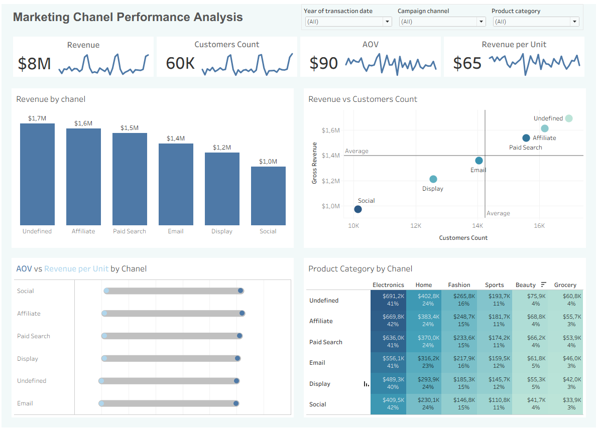

# Marketing Chanel Performance Analysis

## Project Overview
This project analyzes the performance of marketing channels using SQL and Tableau.
The dashboard helps evaluate revenue distribution, customer acquisition, and sales performance across marketing channels.

## Live Dashboard

🔗 **Tableau Public:**  
https://public.tableau.com/views/Book1_17854184525190/Dashboard1?:language=en-US&publish=yes&:sid=&:redirect=auth&:display_count=n&:origin=viz_share_link

## Dashboard Preview

## Business Question
Which marketing channel performs best, and what factors contribute to its revenue performance?

## Tech Stack
- PostgreSQL
- SQL
- Tableau Public
- pgAdmin

## Tasks
- Investigated the effectiveness of marketing channels using transactional sales data.
- Developed and tested hypotheses related to customer acquisition, revenue generation, average order value, and product mix.
- Prepared and validated analytical datasets using SQL.
- Built an interactive Tableau dashboard to compare marketing channel performance.
- Analyzed relationships between Revenue, Customer Count, AOV, Revenue per Unit, and Product Categories.
- Identified data quality issues caused by undefined marketing channels.
- Interpreted analytical results and formulated business recommendations for improving marketing performance.

## Business Metrics
- Revenue
- Customer Count
- Average Order Value (AOV)
- Revenue per Unit

## Key Findings
- Affiliate and Paid Search were the strongest identified marketing channels by revenue and customer acquisition.
- Undefined channel generated the highest revenue, indicating a significant data quality issue.
- Revenue showed a positive association with the number of acquired customers, although causality requires further investigation.
- No meaningful differences were found in AOV or Revenue per Unit across marketing channels.
- A positive relationship was observed between customer acquisition and revenue, although additional analysis would be required to establish causality.

## Business Recommendations
- Investigate and resolve the data quality issue causing the large volume of "Undefined" marketing channels.
- Prioritize investment in Affiliate and Paid Search, as they consistently generated higher revenue and attracted more customers.
- Since AOV and Revenue per Unit were similar across channels, focus on increasing customer acquisition rather than expecting higher revenue per order.
- Conduct additional analysis to determine whether the relationship between customer acquisition and revenue is causal rather than correlational.

## Dataset
The analysis is based on transactional sales data containing information about:

- transactions
- customers
- products
- campaigns
- events
