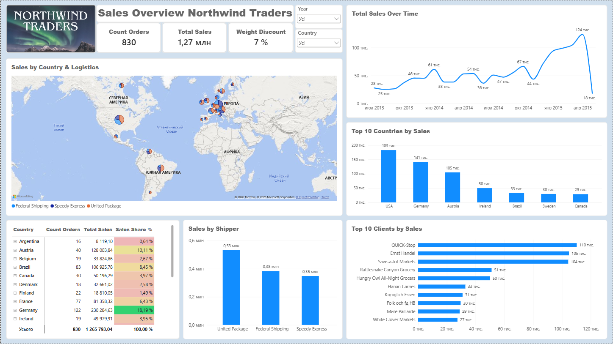
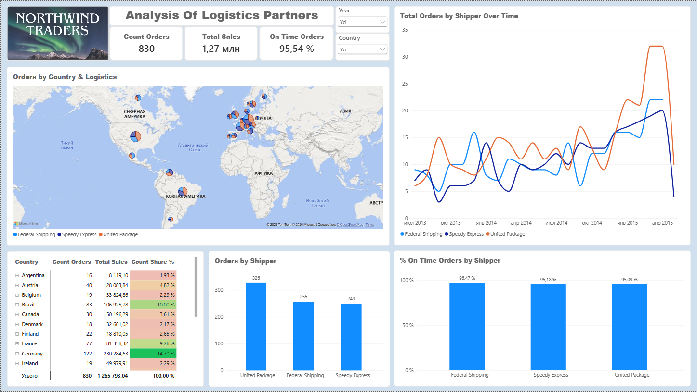
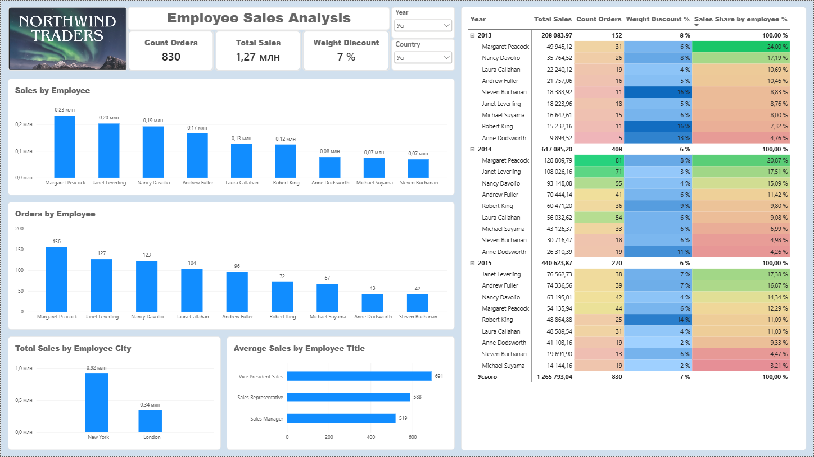
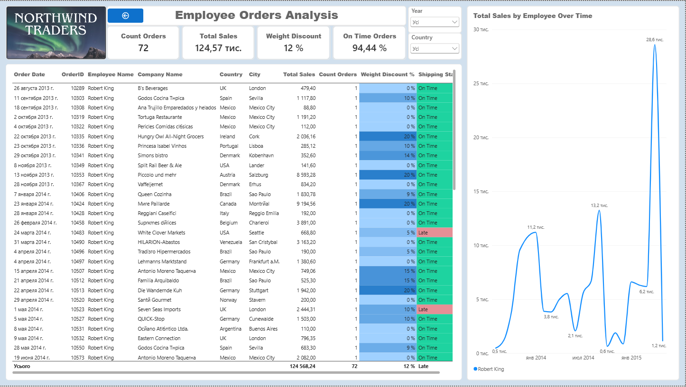

# Sales, Logistics & Employee Performance Analysis

## Project Overview

This project analyzes sales, logistics, and employee performance data of a global retail company using Power BI.

The report provides an overview of sales performance, order distribution, logistics partner performance, and employee workload. It also includes a detailed drill-through page for analyzing individual employee order history.

## Dashboard Preview

### General Sales Analysis

### Logistics Analysis

### Employee Analysis

### Employee Order Detail

## Business Question

How are sales, orders, logistics performance, and employee performance distributed across the business?

## Tech Stack

- Power BI
- DAX
- Power Query

## Tasks

- Explored and prepared the Northwind Traders dataset for analysis.
- Built a dimensional data model using a star schema.
- Created a dedicated Date table for time-based analysis.
- Added calculated columns and DAX measures for key business metrics.
- Analyzed sales trends, order volumes, discounts, and top customers.
- Compared order distribution across countries and logistics partners.
- Analyzed logistics partners by order volume and on-time delivery performance.
- Evaluated employee workload, sales performance, and yearly sales rankings.
- Created a drill-through page for detailed employee order history.
- Designed a multi-page interactive Power BI report for business analysis.

## Business Metrics

### Sales Analytics

- Revenue
- Order Count
- Discount Rate
- Sales by Country
- Top Customers

### Logistics Analytics

- On-Time Delivery Rate
- Late Delivery Rate
- Orders by Logistics Partner
- Orders by Country

### Employee Performance

- Employee Sales
- Orders per Employee
- Average Weighted Discount
- Annual Sales Ranking

## Report Structure

### General Sales Analysis

Provides an overview of financial and sales performance, including sales trends, total revenue, order volume, discounts, top customers, sales by country, and order distribution by logistics partner.

### Logistics Analysis

Focuses on logistics partner performance, including order volume, on-time delivery rate, yearly order trends, and order distribution across countries.

### Employee Analysis

Provides an overview of employee workload and performance, including orders processed, sales, weighted average discount, and yearly sales rankings.

### Employee Order Detail

A drill-through page designed for detailed analysis of an individual employee's order history. The page includes key performance indicators such as shipments, revenue, weighted average discount, and on-time delivery rate.

## Data Modeling

The report uses a star schema to organize sales, customer, product, employee, logistics, and date-related data.

The data model also accounts for hierarchical relationships within the product structure and supports cross-filtering between different analytical dimensions.

## Dataset

The analysis is based on the Northwind Traders dataset containing information about:

- orders
- order details
- customers
- products
- categories
- employees
- shippers
- dates

The original dataset also includes a data dictionary describing the available tables and fields.