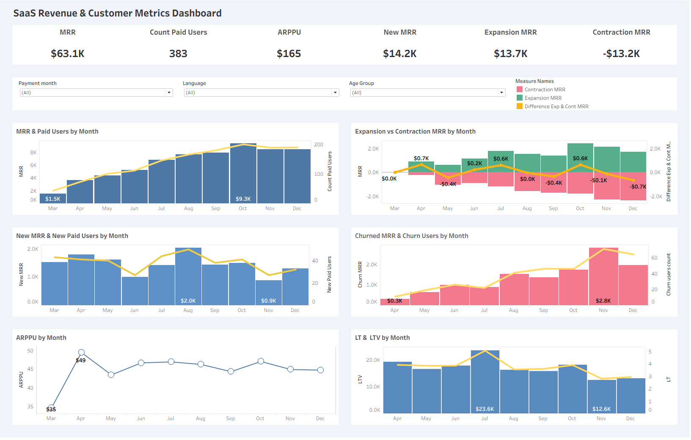

# SaaS Revenue & Customer Metrics Dashboard

## Project Overview
This project analyzes subscription revenue and customer lifecycle metrics for a SaaS business using PostgreSQL and Tableau.
The dashboard helps product managers monitor monthly revenue trends, customer acquisition, churn, and subscription growth 
while identifying the main factors affecting Monthly Recurring Revenue (MRR).

## Live Dashboard

🔗 **Tableau Public:**  
https://public.tableau.com/views/projecttb_17850938079510/RevenueCustomerMetricsDashboard2?:language=en-US&publish=yes&:sid=&:redirect=auth&:display_count=n&:origin=viz_share_link

## Dashboard Preview

## Business Question
How is subscription revenue changing over time, and what factors drive changes in Monthly Recurring Revenue (MRR)?

## Tech Stack
- PostgreSQL
- SQL
- Tableau Public
- DBeaver

## Tasks
- Prepared subscription data using SQL in PostgreSQL.
- Calculated core SaaS subscription metrics using SQL and Tableau calculations.
- Built an interactive Tableau dashboard for monitoring subscription revenue.
- Analyzed monthly changes in MRR and Paid Users.
- Measured customer acquisition, churn, expansion, and contraction revenue.
- Evaluated customer lifetime metrics (LT and LTV).
- Designed filters by payment month, language, and customer age group.

## Business Metrics
- Monthly Recurring Revenue (MRR)
- Paid Users
- Average Revenue per Paid User (ARPPU)
- New Paid Users
- New MRR
- Churned Users
- Expansion MRR
- Contraction MRR
- Customer Lifetime (LT)
- Customer Lifetime Value (LTV)

## Key Findings
- MRR and the number of paid users showed an overall upward trend during most of the observed period.
- Growth in MRR was primarily supported by New MRR and Expansion MRR, while Contraction MRR and customer churn reduced overall revenue growth.
- Churn increased noticeably toward the end of the analyzed period, indicating a potential retention issue that should be investigated further.
- ARPPU remained relatively stable throughout the period, suggesting that revenue growth was driven more by customer acquisition and retention than by higher spending per customer.
- LT and LTV fluctuated over time, providing additional insights into customer retention and long-term customer value.

## Business Recommendations

- Continuously monitor MRR together with Expansion MRR and Contraction MRR to identify revenue growth and decline trends.
- Investigate periods with increased churn to understand the reasons for customer loss and improve retention.
- Focus on strategies that increase Expansion MRR while minimizing Contraction MRR to achieve sustainable recurring revenue growth.
- Track LT and LTV over time to evaluate long-term customer value and support product and marketing decisions.

## Dataset
The analysis is based on subscription payment data containing information about:

- games_payments
- games_paid_users
